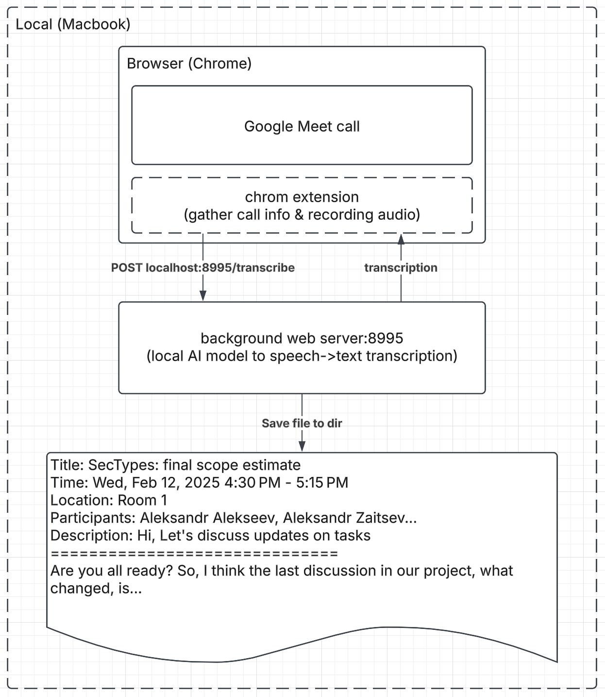
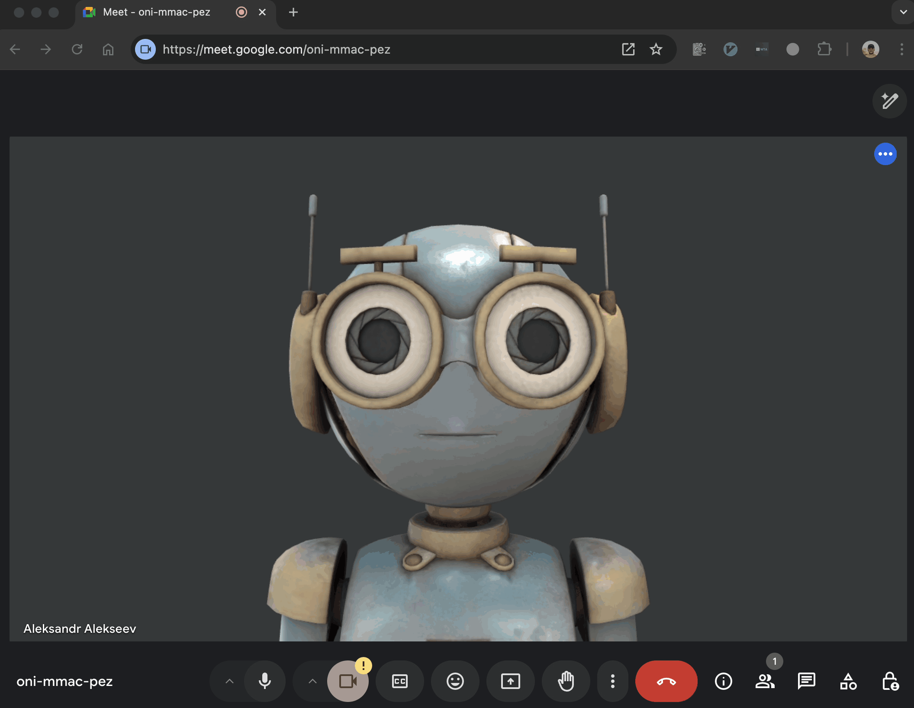

# Audio Transcriber & Summarizer˙ _(not yet)_


This is a audio transcriber and summarizer˙ _(not yet)_.

## 🤌 Motivation

I wanted to create a tool that would help me summarize audio files of my Google Meet calls.
All the tools I found were either too expensive or not good enough with multilingual support.
Also, most of them are not open source and processing audio files on the external servers.

## 🚀 Features

- support for multiple languages
- support for multiple audio and video formats (mp3, wav, mp4, etc)
- full control over the data (no cloud processing)
- gathering Google Meet call metadata (title, description, participants, time, location, etc)

## 🚧 Limitations

- only Google Chrome & Meet are supported
- only macOS is supported

Still, you can use the server part to process audio files from other sources (see [Usage](#-usage) section).

## 🏗️ Architecture

The project is divided into 2 main parts:

- Google Chrome Extension - to gather metadata from Google Meet calls and record audio
- Server part - to process audio files



Chrome Extension is responsible for gathering metadata from Google Meet calls and recording audio.
The server part is responsible for processing audio files and generating summaries.
Summary is generated by transcribing audio files and then summarizing the text.
Transcription files are stored in a predefined directory: ~/Downloads/transcriptions

## 📦 Dependencies

- homebrew - to install all other dependencies
- ffmpeg - to convert audio and video files for processing
- uv - to install python dependencies

## 🛠️ Installation

```bash
./server_install.sh
🏃 Installing audio_summarizer...
🚀 Creating directory /Users/aleksandr.alekseev/audio_summarizer...
📦 Installing system dependencies...
Homebrew already exists. Skipping installation...
ffmpeg already exists. Skipping installation...
uv already exists. Skipping installation...
Python venv already exists. Skipping installation...
📦 Installing python dependencies...
Resolved 45 packages in 9ms
Audited 43 packages in 0.20ms
🔥 Warming up the model...
Fetching 2 files: 100%|███████████████████████| 2/2 [00:00<00:00, 25970.92it/s]
🚀 Installing launchd service...
🌐 Starting server...
🎉 Installation complete! 🎉
🖥️ Press any key to open Chrome to the extension page...
```

This script will:

- copy project files to the predefined directory: `~/audio_summarizer`
- install all dependencies
- start the server via launchctl (macOS only)

After installation, you need to install the Chrome Extension.
install.sh script will open the Chrome Extensions page where you can install the extension in several steps:

1. Open Chrome Extensions page: chrome://extensions/ (if it's not opened automatically)
2. Enable Developer mode
3. Click on Load unpacked
4. Select the extension directory: ~/audio_summarizer/src/chrome-extension


That's it! You can now use the extension to gather metadata from Google Meet calls and record audio.

## 🚀 Usage

### Chrome Extension

After installation, you will see the extension icon in the top right corner of the Chrome browser.
Better to pin it to the toolbar for easier access.

Usage is extremely simple:

1. Click on the extension icon to start recording. During recording, the icon will change to red.
2. Click on the extension icon again to stop recording. The icon will change back to the original state.
3. Close the Google Meet tab or click on the "Leave call" button to stop recording.

After the call is finished, the following actions will be proceed:

- server will transcribe the audio file (it may take some time)
- after transcription is finished, the transcription file will be saved in the predefined directory: `~/Downloads/transcriptions`
- chrome extension will show a popup with the transcription and call metadata
- you can modify all the fields and copy the final result to the clipboard or download it as a file



### Server

After installation, no additional steps are required to use the server part.
It will start and serve requests on the predefined port: `localhost:8995`

You can use the server.sh script to start, stop, and restart the server.

```bash
./server.sh start
./server.sh stop
./server.sh restart
./server.sh status
```

_Under the hood, this script uses launchctl to manage the server process._

You can also use the server part to process audio files from other sources.
Just send a POST request to the server with the audio file in the request body.

```bash
curl -X POST -F "file=@/path/to/audio/file.mp3" http://localhost:8995/transcribe
```

### Summary

After the transcription is finished, you will find the transcription file in the predefined directory.
Personally, I use ChatGPT to summarize the transcription file with the following prompt:

```
You are an assistant that creates summaries from meeting transcription files.
I will upload files, and your task is to generate a detailed summary without missing any important details.

Each transcription file consists of two sections:
    * Metadata about the meeting
    * Transcription of the conversation

Example file format:

    Title: event#1
    Time: Mon, Feb 10, 2025 10:45 PM - 11:45 PM
    Participants: Aleksandr Alekseev, Anton Maksimovich
    Description: description
    Location: Room 1
    ==============================

    <transcription>

Use the following structure for your response:

    📌 Meeting:
    📅 Time:
    👥 Participants:
    📝 Description:
    📍 Location:

    📝 Meeting Summary:

    Context & Objectives:
        * <point_1>

    Key Topics:
        * <point_1>
            ** <subpoint_1>

    Next Steps:
        * <point_1>

    🎯 Conclusion:
```

Then I upload the transcription file and the summary is generated.

I'm planning to automate this process in the future.
But still I didn't find a good summarization model that works locally with the same quality as ChatGPT,
without the need of 100500 GPUs.

## Uninstall

To uninstall the project, you can use the server.sh script:

```bash
./server.sh uninstall
🚫 Uninstalling audio_summarizer...
```

This will stop the server and remove it from the launchctl services.
But you need to manually remove:

- the project directory: `~/audio_summarizer` (I'm avoiding to remove it automatically to prevent data loss)
- the Chrome Extension: chrome://extensions/

## 🛣️ Roadmap

- [ ] configure server via Chrome Extension: output directory, port, etc
- [ ] chrome extension UI improvements: show transcription progress, show results, etc
- [ ] local summarization (if I find a good summarization local model)
- [ ] Obsidian integration to create notes from summaries with graph view

## ☠️ Disclaimer

- This is an MVP project and you should take into account the following risks:
  - Check the source code before using it to understand what it does
  - The project is tested only on my machine and may not work on yours
- Legal:
  - Recording audio files may be illegal in your country
  - Better to ask for permission before recording audio files

## 📝 License

This project is licensed under the MIT License - see the [LICENSE](LICENSE) file for details.
